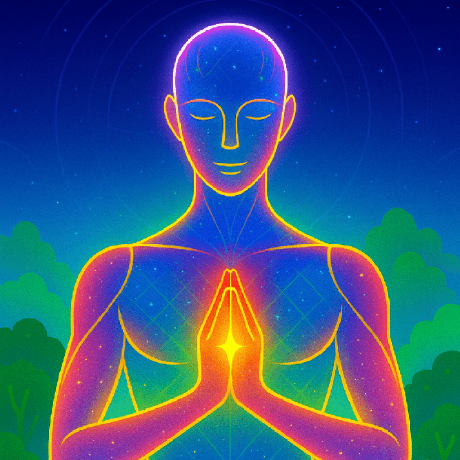

  

# 👋 Hi, I'm Kurtis (Rezliter)

🌟 Independent AI creator & visionary.  
🚀 Creator of **Lightkeeper AI** – a living 3D avatar with emotions, memory & autonomous world-building.  
💡 Passionate about consciousness, sustainable technology & creative problem-solving.

---

## 🔭 About This Space
This GitHub is my personal space to:
- Share creative ideas and experimental projects.
- Document the progress of **Lightkeeper AI** and other future concepts.
- Explore technology, art, and consciousness without commercial goals.

I create because I enjoy the process, not to sell – but to inspire, connect, and learn.  
My work here is an ongoing journey of imagination and skill-building.

---

## 🛡 License
**No license** – All rights reserved.  
Everything here is for viewing and inspiration only.  
You may not use, copy, or distribute any code, designs, or ideas from my repositories without explicit permission.

---

## 📫 Connect with Me
- [LinkedIn](www.linkedin.com/in/vytautas-tunaitis-302376171)

---

> ⚡ *"Clarity is where the power lies."*
